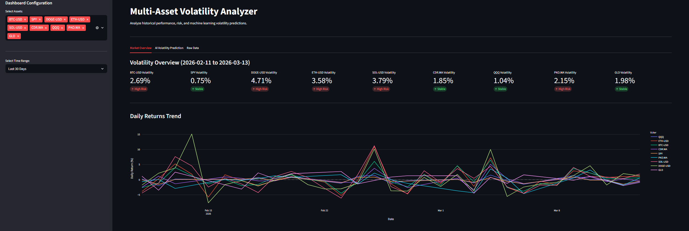
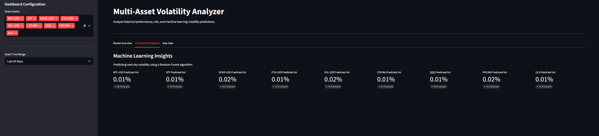

# Financial Volatility Analyzer, ELT Pipeline & ML Predictor




An end-to-end Data Engineering and Machine Learning project that automates the extraction, storage, analysis, and prediction of financial market volatility.

The system tracks Cryptocurrencies (Bitcoin, Ethereum, Solana, Dogecoin), Stocks (S&P 500, NASDAQ, WSE), and Commodities (Gold) to analyze risk across different asset classes.

## Architecture

The project follows a modern ELT (Extract, Load, Transform) pattern combined with predictive analytics:

1. Extract: Python scripts fetch historical and live market data via the yfinance API.
2. Load: Raw data is stored in a PostgreSQL database running in a Docker container.
3. Transform: SQL Window Functions (Views) calculate daily returns and volatility metrics directly within the database.
4. Predict: A Machine Learning module utilizes a Random Forest Regressor to forecast next-day volatility based on short-term rolling metrics.
5. Visualize: An interactive Streamlit dashboard allows users to filter data, compare asset performance, and view AI-driven risk predictions.

## Tech Stack

* Language: Python 3.9+
* Machine Learning: scikit-learn (Random Forest)
* Containerization: Docker & Docker Compose
* Database: PostgreSQL
* Data Processing: Pandas, SQLAlchemy
* Visualization: Streamlit, Plotly
* Source: Yahoo Finance API

## How to Run

### Prerequisites
* Docker & Docker Desktop installed
* Python installed

### Option 1: Automated Start (Recommended)

An automation script is included to initialize the Docker container, install dependencies, run the ETL pipeline, and launch the dashboard sequentially.

```bash
python run_project.py
```